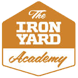

Ruby-Enchiridion
==============

Enchiridion Ruby is an encyclopedia-like collection of notes and resources for topics discussed in [The Iron Yard's Ruby on Rails course](http://theironyard.com/academy/rails-engineering/). It was built to be a quick reference library for students as well as a helpful tool for anyone in the community who wants guidance on specific topics related to the class such as Ruby, HTML, etc...

###Enchiridion? 

**Enchiridion (en-ˌkī-ˈri-dē-ən):** A Late Latin term referring to a small manual or handbook.

A huge number of topics are covered throughout during The Iron Yard's Frontend Engineering course, each with many points of reference that can easily get lost in the fog. We wanted to create a canonical point of reference that students can easily refer back to. Beginning a path in programming can have many forks in the road, and this guide is a means to help point you in the right direction.

#### Pull Requests

While this guide was originally intended for TIY students, our hope is that it is useful to all. As such, we would love to review any contribuitions you have to offer in order to make this guide as good as it can be. 